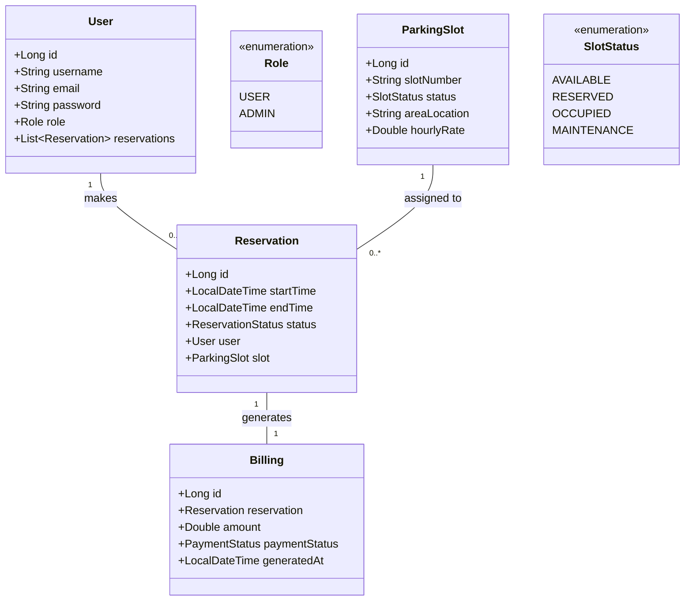

# 🏛 SPMS Architectural Strategy & Roadmap

As a senior software architect, I've outlined the following strategies for the Smart Parking Management System (SPMS). These follow industry-level clean architecture and SOLID principles.

---

## 🗺 1. Use Case Diagram

```mermaid
usecaseDiagram
    actor "User" as U
    actor "Admin" as A

    package "Smart Parking Management System" {
        U --> (Register/Login)
        U --> (Check Slot Availability)
        U --> (Reserve Parking Slot)
        U --> (Check-in/Check-out)
        U --> (View Billing & Payment)
        
        (Manage Parking Slots) <-- A
        (Monitor Real-time Dashboard) <-- A
        (Generate Reports & Analytics) <-- A
        (Manage User Accounts) <-- A
    }
```

---

## 📊 2. Class Diagram



---

## 📂 3. Professional Full-Stack Folder Structure

We organize the project as a monorepo for easier management during the MVP phase while keeping frontend and backend decoupled for independent deployment.

```
SPMS/
├── backend/                # Spring Boot (API)
├── frontend/               # Next.js (Client)
├── database/               # SQL & Liquibase/Flyway migrations
├── docs/                   # Diagrams, SRS, and API Docs
├── infrastructure/         # Docker, CI/CD, Nginx configs
└── README.md
```

---

## 🏗 4. Microservice-Ready Backend Architecture

While starting as a monolithic Spring Boot app, we apply **Domain-Driven Design (DDD)**. Each core module can be extracted into its own service later with minimal effort.

- **Presentation Layer**: Controllers handling HTTP requests.
- **Service Layer**: Business logic (transactional boundaries).
- **Repository Layer**: Data access via JPA.
- **Security Layer**: Custom filters, JWT logic, and RBAC.

---

## 🎨 5. Frontend Feature-Based Architecture

We follow a modular **Feature-First** approach in Next.js to ensure components are scoped correctly.

```
frontend/src/features/
├── auth/            # Login, Signup, Role-based route guards
├── reservation/     # Booking slot, viewing calendars
├── slots/           # Real-time slot status, maps
└── admin-panel/     # User/Slot management, Reporting
```

---

## 🔌 6. REST API Endpoint Structure (v1)

We use standardized RESTful naming and versioning for longevity.

### 🔐 Authentication
- `POST /api/v1/auth/register`
- `POST /api/v1/auth/login`
- `GET /api/v1/auth/me` (Profile)

### 🅿️ Parking Slots
- `GET /api/v1/slots` (List all)
- `GET /api/v1/slots/{id}/status`
- `PATCH /api/v1/slots/{id}` (Admin only)

### 📅 Reservations
- `POST /api/v1/reservations` (Create)
- `GET /api/v1/reservations/{id}`
- `DELETE /api/v1/reservations/{id}` (Cancel)

### 📊 Billing & Reports
- `POST /api/v1/billing/pay`
- `GET /api/v1/reports/revenue` (Admin only)

---

## 👥 7. Team Task Distribution (Role-Based)

- **Backend Lead (Ridoy)**: Core security (JWT/RBAC), Framework setup, Exception handling.
- **Backend Dev (Priom)**: Reservation logic, Slot management, Billing algorithms.
- **Frontend Lead (Nahid)**: Layouts, Global state (Zustand/Redux), Auth integration.
- **Analytics Dev (Rahat)**: PDF/Excel report export, Complex analytics queries.
- **DB Engineer (Mahdiul)**: Schema optimization, Indexing, JPA entity relationships.

---

## 🔐 8. Security Best Practices

1.  **Stateless JWT**: Short-lived access tokens with secure HTTP-only cookies for refresh.
2.  **password Hashing**: BCrypt with high cost factor.
3.  **CORS & CSRF**: Strictly defined whitelists and Next.js CSRF protection.
4.  **Rate Limiting**: Throttling login attempts to prevent brute force.
5.  **Audit Logs**: Recording every administrative action in the DB.

---

## 📈 9. Scalability & Deployment Readiness

- **Containerization**: Use `docker-compose` for local dev (MySQL + Backend + Frontend).
- **Caching**: Implement **Redis** for frequently accessed slot statuses.
- **CDN**: Serve static assets and icons via a CDN to reduce Next.js server load.
- **Load Balancing**: Use Nginx or ALB to distribute traffic between backend instances.
- **CI/CD**: GitHub Actions for automated linting, testing, and Vercel/EC2 deployments.

---
*Created by: Senior Software Architect*
